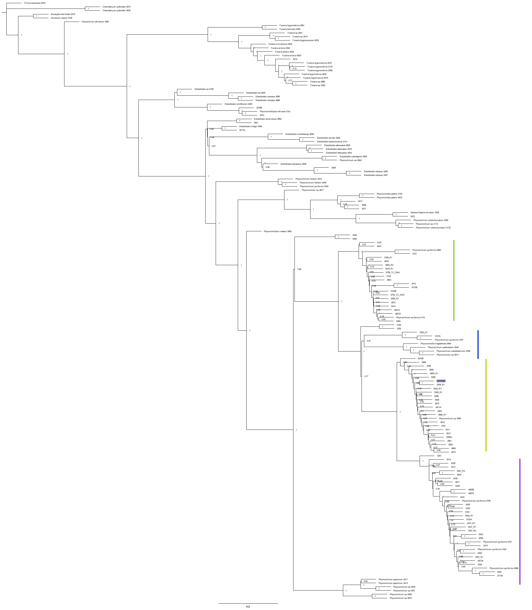

# **_P. pyriforme_ genome assembly**

## Sample Backround

Sample name | Flye (Mb) | Shasta (Mb) | Masurca (Mb) | Wengan (Mb) | Initial estimated contamination levels (centrifuge)
-- | -- | -- | -- | -- | --
14813/Haploid | ~570 | n/a | ~580 | ~520 | ~30%
3798/Polyploid | ~2,250 | ~500 | ~1,200 | ~600 | ~40%

14813 - Physcomitrium pyriforme 

Mansfield, CT     
Ploidy: Haploid   
Genome size: ?    
Data available: One flongle run yields >50% contamination.     
Status: Full nanopore run

3798 - Physcomitriym pyriforme

Dare County, North Carolina   
Ploidy: diploid   
Heterozygosity: High heterozygosity - likely allopolyploid  
Genome size: ~500mb     
Data available: Flongle run and full nanopore run

5074 - Physcomitrellopsis africana

Ploidy: haploid   
Heterozygosity: low heterozygosity  
Data available: nanopore run 

3798 is a hybrid between _P pyriforme_ and _P hookeri_ . 14813 is not a part of this tree, however it was determined that 14813 is part of the purple subclade. Theoretically, 14813 could be a progenitor of 3798.

## Preliminary results

Centrifuge/Kraken results are in this spreadsheet: 
3798: https://docs.google.com/spreadsheets/d/11go67Dql56dhhBo1JlUH7nulwTDp2iDw1IhnIql3CwQ/edit#gid=1318488447
14813: https://docs.google.com/spreadsheets/d/10-T0KEMeH1iY9UJOcyUV9zMDkdjMJKMdn2GEunHj5x4/edit?usp=sharing
All analyses related to the samples are under the relevant folders.

