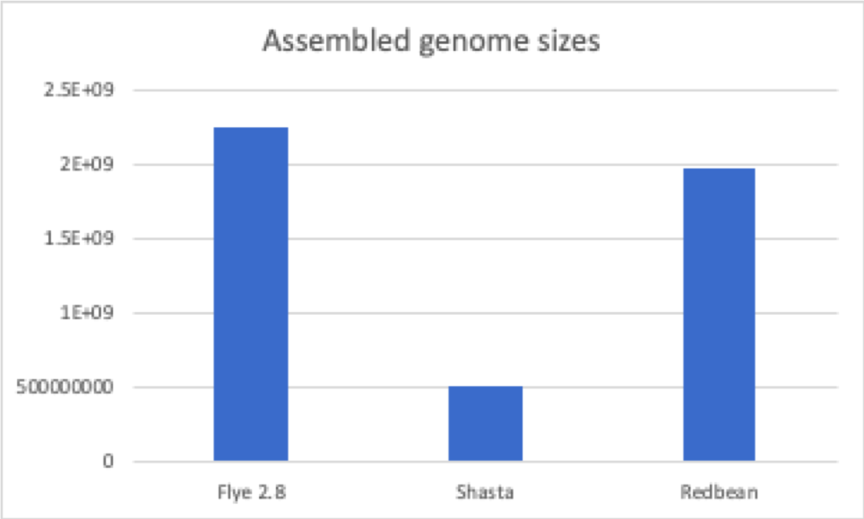
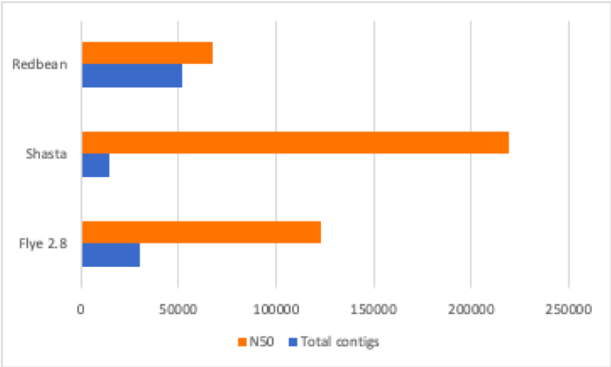

## Flongle run
Samples 14813 and 3798 were tested for contamination after a flongle run. 
1. Nanoplot was used to gather stats about the run
2. Quality check was done with Quast
3. Centrifuge was run against archae, bacteria and viruses, as well as the fungal databases to check the level of contamination in the flongle run. 

All stats recorded in this [spreadsheet](https://docs.google.com/spreadsheets/d/1cM6nhRrUKnQcvcTmS2nZ1lNUeYKa9WHmS3UbRELYxeI/edit#gid=0). 

Due to the amount of contamination, as well as the higher N50, sample 3798 was chosen for this genome assembly. 

## Shasta Assembly
The uncontaminated reads from the flongle run of 3798 and the runs from a Nanopore runs were chosen for shasta assembly. Quast was used to check the qualiy of the
assembly. 

Stats for the assembly are recorded [here](https://docs.google.com/spreadsheets/d/18px8Unlwzny7Mnu992Y85ujnlOxSAIqyKWWtMOivWUA/edit#gid=1918994077). 

## Flye Assembly

1) Flye (2.8.2) assembly error resulting from redundant seqids between data from the flongle and data from the full nanopore run .err file [here](https://docs.google.com/document/d/1cF2G2NrGqWMf4neIBEYE-MmylCmR69YF_sV-bjRwcjc/edit)

      A) Appended an 't' to the end of each seqid for data produced from flongle combined with full flongle run.              e.g   @b7cfd826-a42a-4a67-8d0d-3e72aadac842t  the file:   all_data_reps_removed3.fastq
      B) Re-ran Flye with the new data file using .sh file here: [here](https://docs.google.com/document/d/1bD28EzeCxZIHPJxicKXgiIAW5zqgEg6Jq_kWXfvc2Bk/edit)
      
2) Flye runs for ~24 hrs and ends because of memory. 
      A) Increased memory to 200G. Also the number of threads were in conflict so they were modified to be         consistent. .sh file [here](https://docs.google.com/document/d/15KVEgnsOwQNONehESThCVSKm_zJSeTSa6cMEwFSg544/edit)
      B) Flye runs but terminates after 22 hours and ends but does not appear to have completed. see folders run2 and run3

3) There is a possible error with the newest version of flye 2.8.2. Running Flye with oldest version of flye to test this.

## Redbean/wtdbg2
Link to [redbean/wtdbg2 github manual](https://github.com/adigenova/wengan).

The redbean pipeline is a de novo assembler for noisy long reads. Redbean is a newer assembler with a number of benefits for long read assembly. It functions without prior error correction. It’s especially useful for nanopore assembly because it utilizes short kmers to account for the fact that nanopore data is more error prone and has lower coverage. 
The result is that paralogous regions are better resolved, but it results in a more fragmented assembly. It’s also a faster assembler. Our assembly with redbean took 16 hours, whereas flye took 1-2 days, and canu has been running for 11+ days.

## Wengan
Link to [wengan github manual](https://github.com/adigenova/wengan).

Wengan is a hybrid assembler, requiring inputs from both short and long reads. The script ultimately failed because we only have long reads at this time. We might utilize this script in the future after we have access to short reads for analysis. 

## Miniasm
Link to [miniasm github manual](https://github.com/lh3/miniasm).

Miniasm was designed to assemble noisy longreads. We attempted several iterations of adjusting flags with this assembly script, but ultimately the script failed because the miniasm assembly pipeline is currently experiencing software bugs. The 1st and 2nd miniasm.sh scripts failed due to incorrect flags. The 3rd script failed at step 5 when attempting to generate unitigs. In light of the known software bugs associated with miniasm, we decided to give miniasm the boot & cancel the 4th script job in order to free up memory to run the canu assembly pipeline. 

## Canu
Link to [canu quickstart manual](https://canu.readthedocs.io/en/latest/quick-start.html). Link to [canu github manual](https://github.com/marbl/canu).

Canu was designed to assemble Oxford & PacBio Nanopore long reads. The canu assembly script initially failed 3 times due to incorrect flag selection, but the 4th attempt has been successful so far (still running). The flags we used included turning off the grid and setting the genome size to 500m. 
Typically, canu assemblies take ~5 days to complete, but our canu assembly pipeline has been running for 13 days, as of 5/6/21. The output files have not yet been transferred to the shared directory yet, since the assembly is still running. The three phases of the canu pipeline are correction, trimming & assembly. The output files indicate that the pipeline is currently at the “obtovl overlap” step, which began on 5/3/21. The output files are running in Kris’ directory at Path /home/FCAM/kanderson/canu/canu_trial4. The canu files will be transferred to the shared directory once the run is complete.

Ultimately, we had three final assemblies from shasta, flye, and redbean. In terms of processing time:

Assembly | Run times |
---| --- |
Shasta | >1 day |
Flye | 1-2 days |
Redbean | ~16 hours|

Shasta produced an assembly of around 500Mb, whereas flye and redbean assemblies produced assemblies of around 1-2Gb. We hypothesize that Shasta may have assembled a fraction of the assembly, or probably a contaminant. In comparison, flye and redbean were able to produce assemblies that were closer in size. In fact, when we ran flye by enforcing "genome size = 500 Mb", the assembler still produced an assembly of around 1 Gbp. This could be a result of the differences in algorithms between the assemblers. 

# Quality Control

## BUSCO
We used [BUSCO](https://github.com/openpaul/busco) to assess the level of completeness for each of our assemblies. All BUSCO runs were done against viridiplantae.

The three assemblies had different busco scores:

Assembly | BUSCO score |
--- | ---- |
Shasta | C:60.0%[S:46.8%,D:13.2%],F:7.1%,M:32.9%,n:425 |
Flye | C:88.9%[S:60.7%,D:28.2%],F:2.4%,M:8.7%,n:425 |
Redbean | C:68.9%[S:56.7%,D:12.2%],F:12.0%,M:19.1%,n:425 |

## QUAST
We used [QUAST](https://github.com/ablab/quast) to assess quality & level of contamination for each of our assemblies. 

Comparison of assembled genome sizes:

Comparison of read lengths and N50:

## Discussion

Looking at the quast results, shasta had the highest N50, and redbean had the most number of contigs. Looking at the combination of N50 and total contigs of redbean, it looks like this assembly is the most fragmented assembly, shasta is the most contiguous assembly, and flye had intermediate values. In comparison, looking at the BUSCO score, flye has the most complete genome in comparison to the other assemblies. 
However, looking at the assembled genome sizes, there is a huge difference in genome sizes between shasta, flye and redbean. Shasta assembled a small genome of around 500Mb. In comparison, flye and redbean assembled genomes of around 2Gbp. We hypothesie that Shasta assembled a contaminant, and therefore this assembly will not be considered for future analysis. The flye and redbean genomes will be further analysed, with additional polishing steps. For future steps, we are waiting on additional short-read data, and this will be used to create more robust assemblies. While we first assumed that the genome size is 500Mb based on flow cytometry data, it looks like the sample is a polyploid genome, with a genome size of around 2Gbp.
